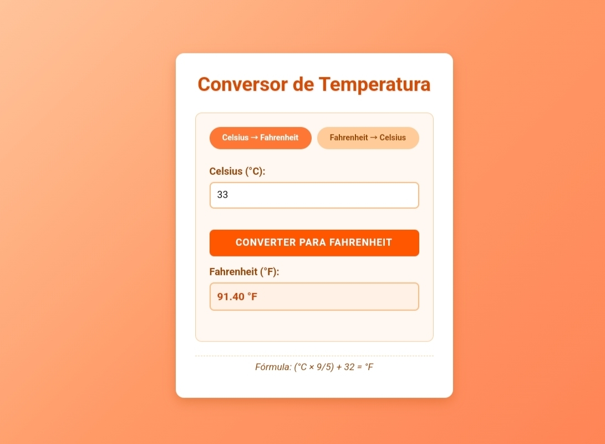

# 🌡️ Conversor de Temperatura

Um aplicativo web simples e intuitivo para conversão de temperatura entre Celsius e Fahrenheit.

## 📋 Descrição

Este conversor de temperatura permite aos usuários:
- Converter de Celsius para Fahrenheit
- Converter de Fahrenheit para Celsius
- Visualizar as fórmulas utilizadas para cada conversão
- Interface amigável com cores quentes e animações sutis

## 🚀 Funcionalidades

- **Conversão bidirecional**: alterne facilmente entre os modos de conversão
- **Cálculo instantâneo**: veja os resultados imediatamente após inserir os valores
- **Interface responsiva**: funciona bem em dispositivos móveis e desktop
- **Feedback visual**: animações sutis indicam quando a conversão é realizada
- **Fórmulas visíveis**: as fórmulas matemáticas são exibidas para fins educacionais

## 🔧 Tecnologias Utilizadas

- HTML5
- CSS3 (com animações e design responsivo)
- JavaScript (vanilla)

## 💻 Como Usar

1. Clone o repositório:
   ```
   git clone https://github.com/seu-usuario/conversor_temperatura.git
   ```

2. Navegue até o diretório do projeto:
   ```
   cd conversor_temperatura
   ```

3. Abra o arquivo `index.html` em qualquer navegador web moderno.

## 📚 Fórmulas Utilizadas

- **Celsius para Fahrenheit**: (°C × 9/5) + 32 = °F
- **Fahrenheit para Celsius**: (°F - 32) × 5/9 = °C

## 📱 Capturas de Tela



## 🧩 Estrutura do Projeto

```
conversor_temperatura/
│
├── index.html         # Estrutura HTML da aplicação
├── style.css          # Estilos CSS e paleta de cores quentes
├── script.js          # Lógica JavaScript para as conversões
└── README.md          # Documentação do projeto (este arquivo)
```

## 🤝 Contribuições

Contribuições são bem-vindas! Sinta-se à vontade para abrir issues ou enviar pull requests para melhorar este conversor.

## 📄 Licença
Este projeto é de código aberto e está licenciado sob a [MIT License](LICENSE).

## 👨‍💻 Autor

Desenvolvido como projeto educacional para prática de HTML, CSS e JavaScript.

---

⭐️ Se este projeto foi útil para você, não esqueça de dar uma estrela! ⭐️